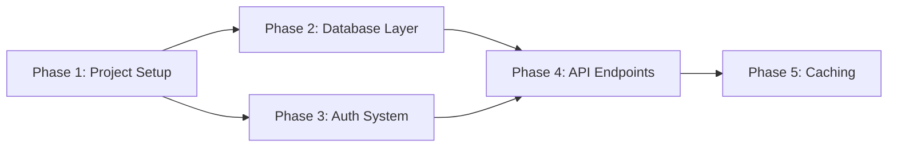

# learning-guide

A Claude Code plugin that turns project development into structured learning opportunities. Instead of just writing code, every refactoring task and new feature becomes a chance to deeply understand the concepts behind it.

Works for **any role** learning **any technology** — frontend devs learning backend, backend devs learning gaming development, data scientists learning DevOps, or anyone building skills through real project work.

## Features

- **Dual-Track Progress** — Every phase tracks both learning milestones AND project deliverables. Code that works but can't be explained = incomplete.
- **Dependency-Aware Navigation** — Phases declare prerequisites, not a strict linear order. When multiple phases are unlocked, you choose which to tackle next. A mermaid dependency diagram shows the full learning path.
- **Design Decision Points** — At meaningful trade-offs, the plugin pauses and presents options so you write the critical 5-10 lines that shape the solution.
- **Background-Specific Analogies** — Maps unfamiliar concepts to your existing expertise (e.g., "A NestJS Guard is like a React Route middleware").
- **Ask Anything, Anytime** — Curious about a concept? Ask freely during any phase. The agent researches, explains, and discusses until you're satisfied. Your explorations are captured and surfaced in your phase review. Type `/lg:next` to refocus.
- **Skip What You Know** — Already familiar with a task? Quick-verify and let Claude handle it. Focus learning time on what actually matters.
- **Preferred Language** — Choose your language during initialization (English, Japanese, Traditional Chinese, etc.) and the entire guide — insights, glossaries, knowledge checks, progress summaries — will be presented in that language. Technical terms stay in English for searchability. Change anytime mid-session.
- **Glossary & Extended Reading** — Each phase includes a visually formatted glossary of key terms and curated links to official documentation, so you can quickly look up concepts or dive deeper on your own.
- **Doc-Grounded Content** — Educational content is verified against up-to-date documentation via research sub-agents before being presented. Sources are cited; uncertainty is flagged.
- **Context-Aware Sessions** — Hooks auto-load your learning state on session start and preserve it through compaction. Pick up exactly where you left off.
- **Phased Curriculum** — Auto-generates a 6-10 phase plan customized to your project and goals, with architecture/design topics woven into each phase. Choose Light, Standard, or Deep depth per phase.
- **Adaptive Learning** — Goals changed? Want to go deeper? Need to pivot mid-phase? Use `/lg:adjust` to dynamically modify your plan while preserving the framework's structural integrity. The guide adapts to you, not the other way around.
- **Persistent Progress** — All state lives in `.learning/` — organized in a single directory, easy to gitignore or track.

## Installation

Via the marketplace (recommended):

```
/plugin marketplace add liamlin/claude-plugins
/plugin install lg
```

Or install directly from this repo:

```
/plugin install liamlin/learning-guide
```

## Quick Start

### 1. Initialize your learning plan

```
/lg:init
```

The plugin interviews you about your background, goals, preferred language, and depth (Light / Standard / Deep), then analyzes your codebase (including tech stack versions) and generates a customized phased plan with a dependency diagram.

### 2. Start a phase

```
/lg:next
```

Shows all unlocked phases (prerequisites met) and lets you choose. Loads only the relevant context via scoped loading, looks up current documentation through a research sub-agent, then presents the design/architecture topic with cited sources. Guides you through implementation with pauses at key decision points.

### 3. Skip familiar tasks

When you already know a concept, just say "I know this, implement it" and Claude handles it after a quick verification.

### 4. Review and complete

```
/lg:review
```

A checkpoint verifier sub-agent validates all deliverables, then you confirm your understanding through reflection questions. A compact journal entry is saved for future sessions. Skipped items get a lighter review.

### 5. Check progress anytime

```
/lg:progress
```

Shows dual-track progress across all phases, with unlocked and locked phase visibility.

## Commands

| Command | Description |
|---------|-------------|
| `/lg:init` | Interactive initialization: define goals, choose language and depth, analyze codebase, generate phased plan with dependency graph |
| `/lg:next` | Start or resume the current learning phase — doubles as a "refocus" command after Q&A |
| `/lg:progress` | View dual-track progress with unlocked/locked phase status |
| `/lg:review` | Phase review: verify deliverables via sub-agent, confirm knowledge, write journal entry |
| `/lg:decide` | Get guided help with a design decision — trade-offs verified against current docs |
| `/lg:adjust` | Adjust your learning plan — change depth, reorder phases, update goals, modify tasks |

## How It Works

### The Learning Flow

```
/lg:init
  -> Interview (background, goals, preferred language, depth)
  -> Codebase analysis (detect tech stack + versions)
  -> Generate phased curriculum with dependency graph
  -> Creates .learning/plan.md + .learning/progress.md

/lg:next
  -> Check prerequisites, show unlocked phases
  -> Load only current phase context + journal (scoped loading)
  -> Research sub-agent fetches current docs
  -> Present design/architecture topic with source citations
  -> Present glossary & extended reading for key terms
  -> Guide implementation with pauses at decision points
  -> Learner writes key code, Claude handles boilerplate
  -> Skip mode for familiar concepts

/lg:review
  -> Checkpoint verifier sub-agent validates deliverables
  -> Knowledge check (reflection questions, lighter for skipped items)
  -> Record design decisions with rationale
  -> Write journal entry for future sessions
  -> Mark phase complete -> unlock dependent phases

/lg:adjust (anytime during execution)
  -> Identify adjustment type (depth, goals, reorder, modify tasks)
  -> Analyze impact on existing plan
  -> Confirm changes with learner
  -> Update plan.md + progress.md + journal.md
  -> Preserve framework integrity (dual-track, prerequisites)

During any phase (explore freely):
  -> Ask questions about concepts, tangential topics
  -> Agent explains using docs + analogies
  -> Exploration notes saved to journal
  -> /lg:next -> Resume block shows progress + next step

/lg:review (enhanced):
  -> Verify deliverables + knowledge check
  -> Surface "Discoveries from Exploration"
  -> Record design decisions with rationale
  -> Learning journey recap when all phases complete
```

### Dependency Navigation

Phases aren't strictly linear. During `/lg:init`, the plugin analyzes the natural dependency structure and generates a mermaid diagram:



When you complete Phase 1, both Phase 2 and Phase 3 unlock — you choose which to tackle first. If all phases happen to be sequential, it works exactly like a linear curriculum.

### Design Decision Points

When code involves meaningful trade-offs, the plugin stops and presents:
- 2-3 options with pros/cons
- Code examples verified against current documentation via research sub-agent
- An analogy from your background
- How production systems handle it (with cited sources)

You decide, implement 5-10 lines, and the rationale is recorded in your progress file.

### Skip Mode

Not every task needs to be a learning moment. When you're already familiar:
1. Tell Claude to skip ("I know this, just implement it")
2. Answer 1-2 quick verification questions
3. Claude implements directly
4. Progress is marked as "(skipped - already familiar)"

This keeps you moving on project deliverables while focusing learning time on genuinely new concepts.

### Content Quality

All educational content is grounded in real documentation rather than relying solely on training data:

- **Research sub-agents** (haiku model) fetch version-specific documentation via Context7 and verify best practices via WebSearch — keeping doc lookups out of the main teaching context
- **Sources are cited** in Insight blocks and trade-off analyses (e.g., "(per NestJS v10 docs)")
- **Uncertainty is flagged** when documentation is unavailable: "Based on general knowledge — verify against current docs"

### Context Window Management

The plugin is designed to work efficiently within Claude Code's context limits:

- **Scoped loading** — Commands read only the current phase and learner profile from `.learning/plan.md`, not the entire file. Journal entries for prerequisite phases provide compact context on what came before.
- **Sub-agent delegation** — Documentation lookups and checkpoint verification are delegated to haiku-model sub-agents, keeping the main teaching conversation focused.
- **SessionStart hook** — Automatically loads your learning state when you open Claude Code in a project with an active plan. No need to re-explain where you left off.
- **PreCompact hook** — Before context compaction, critical learning state is injected so it survives the compaction process.
- **Stop hook** — When a session ends with an active phase, a reminder is injected that progress should already be persisted. The `/lg:next` and `/lg:review` commands handle the actual saving during the session.

## File Conventions

The plugin creates a `.learning/` directory in your project root:

| File | Purpose |
|------|---------|
| `.learning/plan.md` | Full phased curriculum with learner profile, dependency graph, objectives, tasks, decision points, and checkpoints |
| `.learning/progress.md` | Persistent progress tracker with dual-track checkpoints per phase |
| `.learning/journal.md` | Compact, append-only session summaries — what future sessions load instead of re-reading full phase details |

You can add `.learning/` to `.gitignore` to keep learning state private, or track it in git to preserve your learning journey.

## License

MIT
