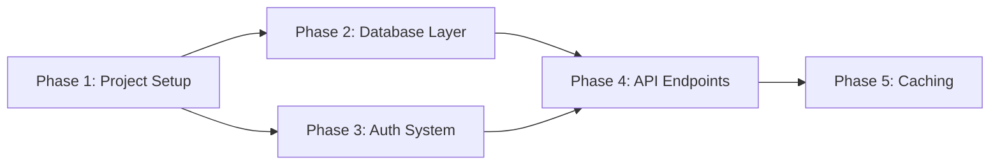

# Learn-by-Building Initialization

Load the `lg:learn-guide` skill using the Skill tool before proceeding. Follow its teaching principles throughout.

## Step 1: Check Existing Plan

Read `.learning/plan.md` and `.learning/progress.md` in the project root. If they already exist, inform the learner and ask if they want to:
- Continue with the existing plan (`/lg:progress`)
- Start fresh (will overwrite existing files)

If no existing plan, proceed to Step 2.

## Step 2: Interview the Learner

Use the AskUserQuestion tool to gather background information. Ask these questions across 1-2 rounds (avoid overwhelming with too many questions at once):

**Round 1 — Background and Goals:**
1. What is your current technical background? (e.g., senior frontend engineer, junior fullstack)
2. What skills or topics do you want to learn? (e.g., a new framework, system design, database design, DevOps, testing strategies, frontend architecture, etc.)
3. How deep should each phase go? Options: **Light** (1-2 checkpoints per track — fast overview), **Standard** (3-4 checkpoints — balanced learning, recommended), **Deep** (5-6 checkpoints — thorough mastery)
4. What language do you prefer for the learning guide? (e.g., English, 日本語, 繁體中文, 한국어, etc.) — All explanations, insights, glossaries, and knowledge checks will be presented in the chosen language. Technical terms remain in English.

**Round 2 — Project-Specific Goals (the "Wish List"):**
5. What do you want to achieve in THIS project? List specific features, refactoring tasks, or improvements you want to complete.
6. What should you be able to do when the learning plan is complete? (skill-level goals)
7. Any deadlines or priority ordering for these goals?

## Step 3: Analyze the Codebase

After the interview, explore the project codebase thoroughly:

1. **Project structure** — Check package.json, directory structure, frameworks used
2. **Current architecture** — Identify modules, patterns, and existing code organization
3. **Technical debt** — Find areas that could benefit from refactoring (learning opportunities!)
4. **Missing pieces** — Identify gaps between current state and the learner's goals
5. **Tech stack with versions** — Note database, ORM, auth system, testing framework, deployment setup. Record exact version numbers from package.json or lock files (e.g., "NestJS 10.3.2, TypeORM 0.3.20, PostgreSQL 16"). These versions are used later by Context7 to fetch version-specific documentation.

Use Glob, Grep, and Read tools to explore the project. Be thorough — the quality of the plan depends on understanding the codebase.

## Step 4: Design the Phased Plan

Based on the interview + codebase analysis, create a customized learning plan:

### Phase Design Rules:
- **6-10 phases** total, depending on scope
- **Match checkpoint count** to the learner's chosen depth (Light: 1-2, Standard: 3-4, Deep: 5-6 checkpoints per track)
- Each phase has **1 primary Design/Architecture topic** (consult `references/system-design-topics.md`)
- Each phase has **1-2 design decision points** (consult `references/phase-template.md`)
- Phases progress from **foundational → advanced** (Tier 1 → Tier 4 topics)
- Each phase produces **verifiable deliverables**
- **Refactoring tasks** from the codebase analysis become learning opportunities within phases
- **New features** from the learner's wish list are distributed across appropriate phases
- Assign **Prerequisites** to each phase — list the phase numbers that must be completed first. Foundation phases have `Prerequisites: none`. Analyze the natural dependency structure of the curriculum; do NOT force sequential dependencies where parallel paths exist.

### Dependency Diagram

After designing all phases with their prerequisites, generate a mermaid dependency diagram and include it in the Phase Overview section of `.learning/plan.md`:



If all phases are purely sequential (each depends only on the previous), note this: "All phases are sequential — complete them in order." and generate a simple linear diagram.

### Dual-Track Checkpoints:
For each phase, define:
- **Learning Checkpoints** — "Can explain X", "Understands trade-off between A and B", "Completed design decision Y with rationale"
- **Deliverable Checkpoints** — "File X created", "Endpoint Y working", "Test Z passing", "Verification command succeeds"

## Step 5: Write the Plan Files

First, create the `.learning/` directory in the project root by running:

```bash
mkdir -p .learning
```

Then suggest to the learner: "Your learning files will be stored in `.learning/`. You can add this to `.gitignore` to keep them private, or track them in git to preserve your learning journey."

Write two files to the `.learning/` directory:

### .learning/plan.md
The full phased curriculum. Follow the format from `references/file-conventions.md`. Make sure to include:
- The **Preferred language** field under Learner Profile with the learner's chosen language (default: "English")
- The **Tech Stack** field under Learner Profile with the specific versions detected in Step 3

Write the plan content (phase names, learning objectives, checkpoint descriptions) in the learner's preferred language. Technical terms remain in English.

### .learning/progress.md
Initialize with all phases in "Pending" status. Include the learner's goals at the top.

```markdown
# Learning Progress — [Project Name]

## Learner Goals
- [Goal 1 from interview]
- [Goal 2 from interview]
- ...

## Skill Goals
- [Skill goal 1 from interview]
- [Skill goal 2 from interview]

## Overall Progress
- Phases completed: 0/[N]
- Current phase: Phase 1 — [Name]
- Design decisions made: 0

---

## Phase 1: [Name] 🔄 In Progress

### Learning Checkpoints
- [ ] [checkpoint 1]
- [ ] [checkpoint 2]

### Deliverable Checkpoints
- [ ] [deliverable 1]
- [ ] [deliverable 2]

---

## Phase 2: [Name] ⏳ Pending
[... repeat for all phases ...]
```

## Step 6: Present and Confirm

Show the learner a summary of the plan:
- Total phases and dependency structure
- Phase overview table (name, Design/Architecture topic, prerequisites, checkpoint count)
- Dependency diagram showing which phases can be done in parallel
- The first phase's details

Ask the learner to confirm or request adjustments. Iterate until they approve.

Once confirmed, suggest: "Run `/lg:next` to start Phase 1!"

Also tell the learner: "During each phase, you'll see Insights and Glossary sections explaining key concepts. **Feel free to ask questions anytime** — explore related topics, dive into anything that interests you, ask 'why' as many times as you want. I'll research and explain until you're satisfied. These explorations become part of your learning record. When you want to refocus, just type `/lg:next`."
