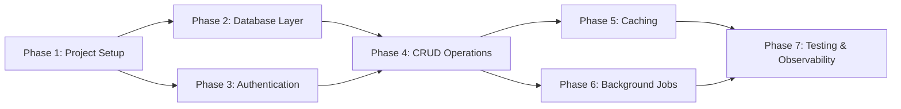

# Learning Plan — Task Manager API

## Learner Profile
- Background: Senior frontend engineer (React, Next.js, 4 years)
- Goals: Learn backend development with NestJS, database design, and REST API best practices
- Preferred language: English
- Phase depth: Standard
- Tech Stack: NestJS 10.3.2, TypeORM 0.3.20, PostgreSQL 16, Jest 29.7

## Phase Overview
| # | Phase | Design/Architecture Topic | Prerequisites | Checkpoints |
|---|-------|--------------------------|---------------|-------------|
| 1 | Project Setup & First Endpoint | REST API Design | none | 4 |
| 2 | Database Layer | Schema Design & Normalization | 1 | 4 |
| 3 | Authentication | Auth Patterns (JWT vs Sessions) | 1 | 4 |
| 4 | CRUD Operations | API Design & Error Handling | 2, 3 | 3 |
| 5 | Caching | Cache Strategies & Invalidation | 4 | 3 |
| 6 | Background Jobs | Message Queues & Async Processing | 4 | 3 |
| 7 | Testing & Observability | Testing Pyramid & Structured Logging | 5, 6 | 4 |

## Phase 1: Project Setup & First Endpoint
### Learning Objectives
- Able to explain REST constraints and resource-based URL design
- Able to compare trade-offs between different HTTP status code choices
- Able to independently create a NestJS controller with proper HTTP method usage

### Design/Architecture Topic: REST API Design
**Concepts to study before coding:**
- REST constraints: stateless, uniform interface, resource-based URLs
- HTTP methods as verbs: GET (idempotent), POST (create), PUT/PATCH (update), DELETE
- Status codes: 2xx success, 4xx client error, 5xx server error

**Familiar concept analogy:** NestJS Controller ≈ Next.js API Route handler; NestJS Service ≈ Custom React Hook (business logic)

### Key Terms (for Glossary)
- **REST** — an architectural style where APIs are organized around resources (nouns) accessed via standard HTTP methods (verbs)
- **Idempotency** — calling the same operation multiple times produces the same result; GET and PUT are idempotent, POST is not
- **Controller** — the entry point for HTTP requests, responsible for routing and response formatting (like a Next.js API route)

### Implementation Tasks
1. Initialize NestJS project with CLI
2. Create `tasks` module, controller, and service
3. Implement `GET /tasks` and `POST /tasks` endpoints
4. Add input validation with class-validator pipes

### Design Decision Points

**Decision Point 1 — Response format for validation errors**
Context: When a client sends invalid data, the API must communicate what went wrong.
Options:
| Option | Pros | Cons |
|--------|------|------|
| Return flat error string | Simple | No structured info for frontend |
| Return field-level errors object | Frontend can highlight fields | More complex response structure |
| Return RFC 7807 Problem Details | Standards-compliant | May be overkill for internal API |

Location: `src/tasks/tasks.controller.ts` — validation error handler
What to write: Custom exception filter (5-10 lines) that formats validation errors
Trade-off to consider: Simplicity vs frontend developer experience

### Checkpoints
#### Learning Checkpoints
- [ ] Can explain REST constraints and why APIs use resource-based URLs
- [ ] Understands trade-offs between different error response formats
- [ ] Completed design decision on validation error format with recorded rationale

#### Deliverable Checkpoints
- [ ] NestJS project initialized and running on port 3000
- [ ] `GET /tasks` returns empty array, `POST /tasks` creates a task
- [ ] Invalid POST requests return structured validation errors
- [ ] All endpoints verified with curl or HTTP client

### Verification
1. `curl http://localhost:3000/tasks` — returns `[]`
2. `curl -X POST http://localhost:3000/tasks -H "Content-Type: application/json" -d '{"title": "Test"}'` — returns created task with id
3. `curl -X POST http://localhost:3000/tasks -H "Content-Type: application/json" -d '{}'` — returns validation error
